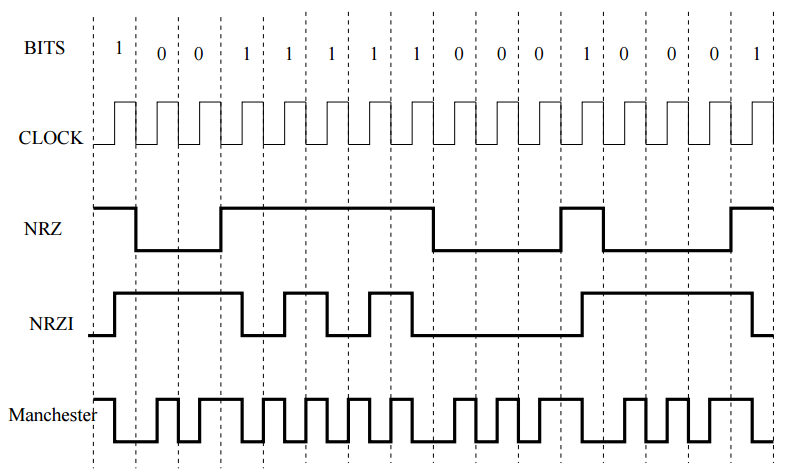
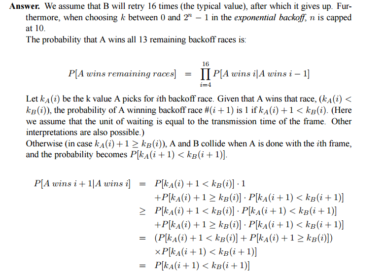
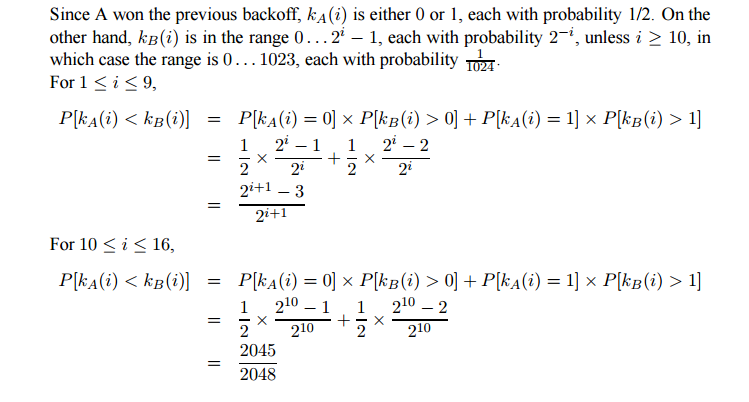
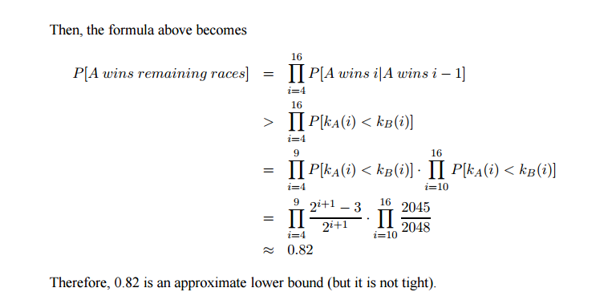
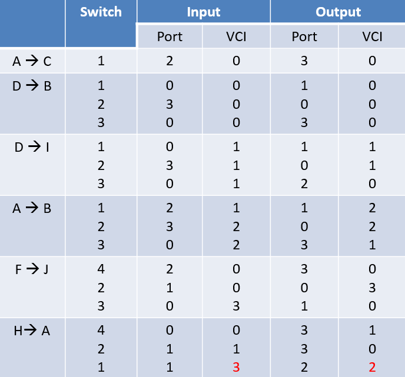

# Computer Networks

## Glossary

- LAN local-area nextwork
- MAC media access control
- ARQ automatic repeat request
- CSMA/CD/CA carrier sense multiple access with collision avoidance/detection
- CRC cyclic redundancy check
- VCI virtual circuit idetifier
- ARP address resolution protocol
- UDP user datagram protocol
- ICMP internet control message protocol
- FTP file transfer protocol
- TCP transmission control protocol
- HTTP hypertext transfer protocol
- RIP routing information protocol
- SMTP simple mail transfer protocol
- POP post office protocol
- IMAP inter message access protocol
- FDDI fiber distributed data interface
- OSPF open shortest path first
- CIDR classless inter-domain routing
- DNS domain name service

## Homework Solutions

### 1-3

#### Question

Calculate the total time required to transfer a 1000-KB file in the following cases, assuming an RTT of 50 ms, a packet size of 1 KB data, and an initial 2×RTT of “handshaking” before data is sent:

(a) The bandwidth is 1.5 Mbps, and data packets can be sent continuously.  
(b) The bandwidth is 1.5 Mbps, but after we finish sending each data packet we must wait one RTT before sending the next.  
(c) The bandwidth is “infinite,” meaning that we take transmit time to be zero, and up to 20 packets can be sent per RTT.  
(d) The bandwidth is infinite, and during the first RTT we can send one packet , during the second RTT we can send two packets, during the third we can send four, and so on.   

#### Solution

Latency = Propagation + Transmit + Queue  
Propagation = Distance / c  
Transmit = Size / Bandwidth  

(a) 50ms/2 + 1000KB/1.5Mbps + 50ms × 2 = 5.333 s  
(b) 5.333 s + 50ms × 999 = 55.283 s  
(c) 50ms/2 + 50ms × 2 + 50ms × 49 = 2.575 s  
(d) 1 + 2 + 2^2 + 2^n-1 = 2^n-1 ≧ 1000 ,  n = 10   
50ms/2 + 50ms × 2 + 50ms × 9 = 0.575 s

### 1-5

#### Question

Consider a point-to-point link 4 km in length. At what bandwidth would propagation delay (at a speed of 2× 10^8m/s) equal transmit delay for 100-byte packets? What about 512-byte packets?

#### Solution

B = 100 × 8 b/ (4 km / (2× 10^8m/s) )  =  4 × 107bps = 40 Mbps  
For 512 byte, B = 512 × 8 b/ (4 km / (2× 10^8m/s) ) = 204.8 Mbps

### 1-11

#### Question

How “wide” is a bit on a 10-Gbps link? How long is a bit in copper wire, where the speed of propagation is 2.3× 108m/s?

#### Solution

1 bit / 10 Gbps = 10^-10s   
10^-10s x 2.3 × 10^8m/s = 0.023 m

### 1-13

#### Question

Suppose a 1-Gbps point-to-point link is being set up between the Earth and a new lunar colony. The distance from the moon to the Earth is approximately 385,000 km, and data travels over the link at the speed of light 3×10^8m/s.  
(a) Calculate the minimum RTT for the link.  
(b) Using the RTT as the delay, calculate the delay × bandwidth product for the link.  
(c) What is the significance of the delay × bandwidth product computed in (b)?  
(d) A camera on the lunar base takes pictures of the Earth and saves them in digital format to disk. Suppose Mission Control on Earth wishes to download the most current image, which is 25 MB. What is the minimum amount of time that will elapse between when the request for the data goes out and the transfer is finished?  

#### Solution

(a) 385,000 km ×2 / 3×10^8m/s = 2.567 s  
(b) 2.567 s × 1 Gbps  =  2.567 Gb  = 328MB  
(c) If the receiver tells the sender to stop transmitting it might receive up to one RTT×bandwidth’s worth of data before the sender manages to respond.  
(d) 2.567s + 25MB / 1 Gbps = 2.767 s

### 1-16

#### Question

Calculate the latency (from first bit sent to last bit received) for the following:  
(a) 100-Mbps Ethernet with a single store-and-forward switch in the path and a packet size of 12,000 bits. Assume that each link introduces a propagation delay of 10 μs and that the switch begins retransmitting immediately after it has finished receiving the packet.  
(b) Same as (a) but with three switches.  
(c) Same as (a), but assume the switch implements “cutthrough” switching; it is able to begin retransmitting the packet after the first 200 bits have been received.  

#### Solution

(a)  (12000 b/ 100 Mbps + 10 μs )× 2 = 260  μs   
(b)  (12000 b/ 100 Mbps + 10 μs )× 4 = 520  μs   
(c)  12000 b/ 100 Mbps + 10 μs  + 200 b/ 100 Mbps + 10 μs = 142 μs 

### 2-1

#### Question

Show the NRZ,Manchester, and NRZI encodings for the bit pattern shown in Figure 2.36. Assume that the NRZI signal starts out low.

#### Solution

### 2-2

#### Question

Consider an ARQ algorithm running over a 40-km point-to-point fiber link.  
(a) Compute the one-way propagation delay for this link, assuming that the speed of light is 2×10^8 m/s in the fiber.  
(b) Suggest a suitable timeout value for the ARQ algorithm to use.  
(c) Why might it still be possible for the ARQ algorithm to time out and retransmit a frame, given this timeout value?

#### Solution

(a) 40 km / 2×10^8 m/s = 0.2ms  
(b) 0.2 ~ 0.4 ms  
(c) Propagation delay is only one source of delays. Packets may experience delays by sitting in queues waiting to be processes and acknowledged. If these delays exceed the safety constant than ARQ will retransmit. 

### 2-3

#### Question

The text suggests that the sliding window protocol can be used to implement flow control. We can imagine doing this by having the receiver delay ACKs, that is, not send the ACK until there is free buffer space to hold the next frame. In doing so, each ACK would simultaneously acknowledge the receipt of the last frame and tell the source that there is now free buffer space available to hold the next frame. Explain why implementing flow control in this way is not a good idea.

#### Solution

If the receiver delays sending an ACK until buffer space is available, it risks delaying so long that the sender times out unnecessarily and retransmits the frame.

### 2-4

#### Question

Let A and B be two stations attempting to transmit on an Ethernet. Each has a steady queue of frames ready to send; A’s frames will be numbered A1, A2, and so on, and B’s similarly. Let T = 51.2 μs be the exponential backoff base unit. Suppose A and B simultaneously attempt to send frame 1, collide, and happen to choose backoff times of 0×T and 1×T,
respectively, meaning A wins the race and transmits A1 while B waits. At the end of this transmission, B will attempt to retransmit B1 while A will attempt to transmit A2. These first attempts will collide, but now A backs off for either 0×T or 1×T, while B backs off for time equal to one of 0×T, . . . ,3×T.

(a) Give the probability that A wins this second backoff race immediately after this first collision; that is, A’s first choice of backoff time k ×51.2 is less than B’s.

(b) Suppose A wins this second backoff race. A transmits A3, and when it is finished, A and B collide again as A tries to transmit A4 and B tries once more to transmit B1. Give the probability that A wins this third backoff race immediately after the first collision.

(c) Give a reasonable lower bound for the probability that A wins all the remaining backoff races.

(d) What then happens to the frame B1? This scenario is known as the Ethernet capture effect.

#### Solution

(a) 1/2 x 4/3 + 1/2 x 2/4 = 5/8  
(b) 1/2 x 7/8 + 1/2 x 6/8 = 13/16  
(c) 

(d) B1 will be dropped, and B will try the next frame B2.

### 2-5

#### Question

Suppose A, B, and C all make their first carrier sense, as part of an attempt to transmit, while a fourth station D is transmitting. Now with the assumption that Ethernet is p-persistent with p = 0.33 (that is, a waiting station transmits immediately with probability p when the line goes idle and otherwise defers one 51.2-μs slot time and repeats the process). 

Draw a timeline showing one possible sequence of transmissions, attempts, collisions, and exponential backoff choices. Your timeline should meet criterion:  
 (i) of the previous problem, but in lieu of criterion  
 (ii) you should show at least one collision and at least one run of four deferrals on an idle line.   
Again, note that many solutions are possible.  

#### Solution

### 3-1

#### Question

Using the example network given in Figure 3.44, give the virtual circuit tables for all the switches after each of the following connections is established. Assume that the sequence of connections is cumulative; that is, the first connection is still up when the second connection is established, and so on. Also assume that the VCI assignment always picks the lowest unused VCI on each link, starting with 0, and that a VCI is consumed for both directions of a virtual circuit.  
(a) Host A connects to host C.  
(b) Host D connects to host B.  
(c) Host D connects to host I.  
(d) Host A connects to host B.  
(e) Host F connects to host J.  
(f ) Host H connects to host A.  

#### Solution

### 3-3

#### Question

For the network given in Figure 3.45, give the datagram forwarding table for each node. The links are labeled with relative costs; your tables should forward each packet via the lowest-cost path to its destination.

#### Solution

### 3-5

#### Question

Consider the virtual circuit switches in Figure 3.47. Table 3.15 lists, for each switch, what <port, VCI> (or <VCI, interface>) pairs are connected to what other. Connections are bidirectional. List all endpoint-to-endpoint connections.

#### Solution

A -> S1 -> S2 -> S3 -> D  
A-> B  
B -> S1 -> S2 -> S3 -> D

### 3-13

#### Question and Solution

Given the extended LAN shown in Figure 3.48, indicate which
ports are not selected by the spanning tree algorithm.

### 3-15

#### Question

Consider the arrangement of learning bridges shown in Figure 3.49. Assuming all are initially empty, give the forwarding tables for each of the bridges B1 to B4 after the following transmissions:  
  A sends to C.  
  C sends to A.  
  D sends to C.  
Identify ports with the unique neighbor reached directly from that port; that is, the ports for B1 are to be labeled “A” and “B2.”

#### Solution

A -> B1 -> B2 -> B3 -> C  B4 -> D  
C -> B3 -> B2 -> B1 -> A  
D -> B4 -> B2 -> B3 -> C  

B1:   A ->  A        B2 -> C  
B2:   B1 -> A       B3 -> C    B4 -> D   
B3:  B2 -> A, D    C -> C  
B4:   B2 -> A        D ->D  

